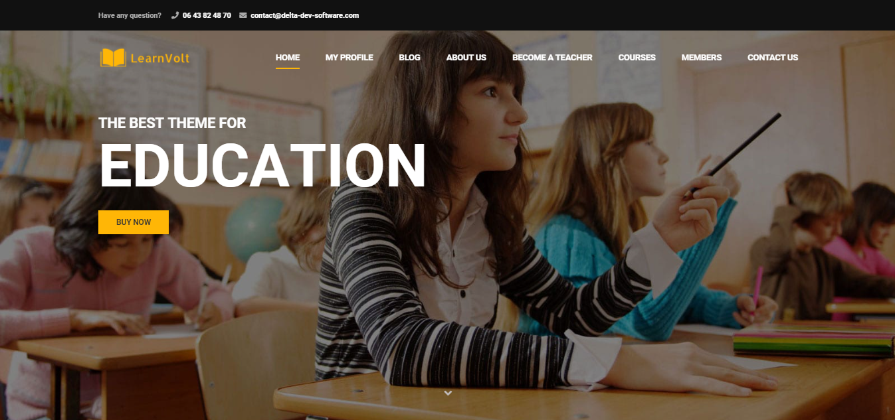

Learn volt is web application aims to help the school, university, tuition centre, private organization to perform online learning which let the teachers/instructors and students to perform some common class activities online. Instructors and students have to register themselves and wait for the admin to approve their registration request in order to login to the portal.

## Table of contents
* [General info](#general-info)
* [Demo](#demo)
* [Screenshots](#screenshots)
* [Technologies](#technologies)
* [Setup](#setup)
* [Features](#features)
* [Status](#status)
* [Contact](#contact)
* [License](#license)

## General info

## Demo

## Screenshots

## Technologies
* Wordpress - version 5.6

## Setup

## Features

 - **Collaboration**  Of Various Learning Tools.
 -  Strong  **Reporting**  With Customization. 
 -  Web-Based Business Support. 
 -  Brand  **Integration**. 
 -  Online Course Catalogs.
 -  **Self**  Registration. ...
 -  Responsive Design Features.
 -  Accreditation Support

## Status
Project is: _finished_

## Contact
contact@delta-dev-software.com

## License
<a href="license.txt">MIT License</a>